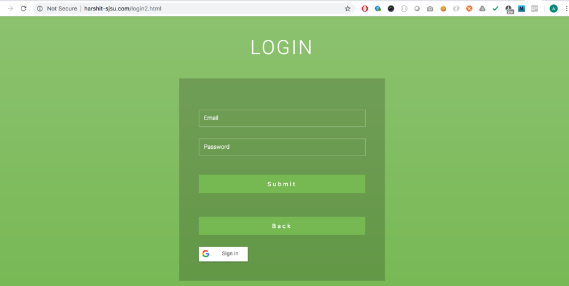

# Place It !! 

 <h3> Introduction :</h3>

<h3> Place It - Introduction </h3>
Place It, is a web application hosted on AWS cloud which intends to provide access to the Authorized users for maintaining their files storage on cloud backed up by strong security, availability and durability. The Web Application has used different AWS Components in developing a 3 Tier Web Application. The application assures to provide a highly available, scalable, cost effective solution to store the user files. This application leverages AWS Code Pipeline to provide CI/CD. Also, it uses Elastic Beanstalk as the deployment environment which offers auto scaling groups and elastic load balancing to provide seamless experience during peak load times. The application uses RDS- MySQL Workbench Engine as a database system to store the details of Users and their files. The application also monitors the metrics of the RDS Instance using Cloud Watch and Cloud Watch Alarm has been set when RDS Instances reaches to the specified state and uses SNS to push the notifications regarding it to to the admin. Application uses lambda function and is triggered whenever the object is uploaded to the S3 Bucket.

<h4> Users can perform the following activities- </h4>

1.Upload new files.

2.Browse through already uploaded list of files with each record having a URL to download the fie. 

3.Update already uploaded files. 

4.Delete already uploaded files.

<h4> AWS Architecture of the project is shown below - </h4>

  

<h4> Feature List- </h4>

Home Page to give three options- Signup and Login for Users and Admin Login to be used by Admin Only for Admin Functionality.

User Functionality-

Sign up form for new user to register for an account.

A new user record is created in AWS RDS MySQL.

Login Page which allows only the authorized users to login.

Performs validation for username and password match with the info in the database.

Dashboard Screen that displays welcome message for users and display their First Name and Last Name.

An option to upload files. Also, displays all the files uploaded by the user previously with the info of the file name, file description, created time, updated time and offers them to download, delete and edit their files. Retrieval of all these data is through RDS database.

Allows authorized users to upload new file on AWS S3 in the bucket. The file to be uploaded cannot exceed a file size of 10MB.

Allows authorized users to download their existing files from S3 via Cloud Front.

Allows authorized users to delete the files they uploaded previously.

Allow authorized users to update their existing file. 

User can Logout using the logout button.

Admin Functionality-

Login Page which allows only the Admin to login.

Performs validation for username and password match using the admin login credentials defined.

Dashboard Screen that displays welcome message for Admin.

An optopn to upload files. Also, displays all the files uploaded by the all the different user with the info of file name, file description, created time, updated time and can delete or download their files. Retrieval of all these data is through RDS database.

<h4>AWS Components Leveraged</h4>

1.Elastic Beanstalk: To provide the deployment environment for our application to run. Enables EC2 instances. Just need to configure the Capacity settings for auto scaling group and load balancing. Applicaton uses two elastic beanstalk environment to support CI/CD Integration with our application.

2.Code Pipeline- To provide the CI/CD Integration with our application, we used two Code Pipelines. One for Development Environment and other for Production Environment. Manual Approval is required in the Production Environment to reflect the changes.

3.S3: Used to upload and maintain user files.

4.S3 Transfer Acceleration: S3 bucket is enabled with Transfer Acceleration to enable faster and secure transfer of files to S3.

5.Standard Infrequent Access (IA): Lifecycle policies are updated on S3 Bucket to move files from Standard to IA after 75 days.

6.Amazon Glacier: Lifecycle policies are enabled on S3 Bucket to move files from IA to Amazon Glacier after 365 days.

7.CloudFront: Download File option given in User and Admin Dashboard is done using CloudFront. The minimum TTL for CloudFront is setup as 40 seconds.

8.AutoScaling Group: For achieving highly available and scalable solution, auto scale group has been used with a desired instance of 2 and max instance of 4. This is configurable based on requirement and traffic the website attracts.

9.Elastic Load Balancer: Load Balancer point to autoscale group so that it handles optimal load on all the EC2 instances associated with the group.

10.RDS: MySQL instance is created to maintain user data and their file metadata.

11.CloudWatch: Cloud watch is used to monitor the capability and metrics of the RDS Instance. Cloud Watch Alarm can be created to infrom the admin through SNS when the Instances reaches in the specified state. 

12.SNS: Configured to send email to all the subscribers for the topic. Created two topics - one for Code Pipeline to push notifications for approval request and other to push the notifications when the RDS Instance reaches the specified state.

13.Lambda: A python program is configured to generate logs whenever the object is uploaded to the S3 Bucket.

<h3> Sample Screenshots </h3>

<b> Home Page</b>

  

<b> Signup Page </b>

  

<b> Login Page </b>

  

<b> Dashboard Page </b>

  

<b> Admin Login Page </b>

  

<b> Admin Dashboard Page </b>

  

